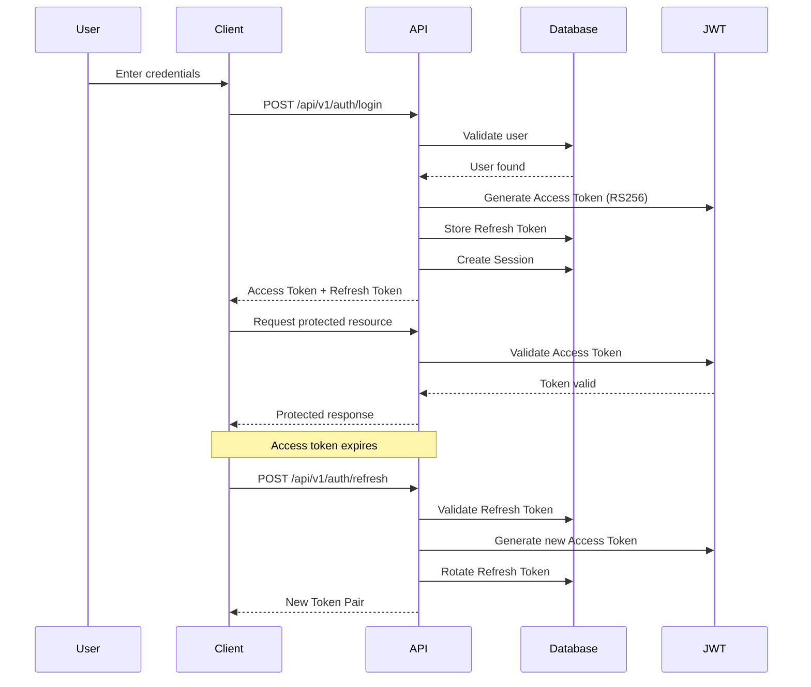

# Authentication Flow

```mermaid
sequenceDiagram

    participant User
    participant Client
    participant API
    participant Database
    participant JWT

    User->>Client: Enter credentials
    Client->>API: POST /api/v1/auth/login
    API->>Database: Validate user
    Database-->>API: User found
    API->>JWT: Generate Access Token (RS256)
    API->>Database: Store Refresh Token
    API->>Database: Create Session
    API-->>Client: Access Token + Refresh Token
    Client->>API: Request protected resource
    API->>JWT: Validate Access Token
    JWT-->>API: Token valid
    API-->>Client: Protected response

    Note over Client,API: Access token expires

    Client->>API: POST /api/v1/auth/refresh
    API->>Database: Validate Refresh Token
    API->>JWT: Generate new Access Token
    API->>Database: Rotate Refresh Token
    API-->>Client: New Token Pair
```