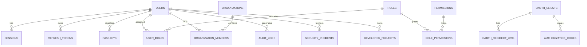

# Database Entity Relationship

```mermaid
erDiagram

    USERS ||--o{ SESSIONS : has
    USERS ||--o{ REFRESH_TOKENS : owns
    USERS ||--o{ PASSKEYS : registers
    USERS ||--o{ USER_ROLES : assigned
    USERS ||--o{ ORGANIZATION_MEMBERS : joins

    ROLES ||--o{ USER_ROLES : contains
    ROLES ||--o{ ROLE_PERMISSIONS : grants
    PERMISSIONS ||--o{ ROLE_PERMISSIONS : maps

    ORGANIZATIONS ||--o{ ORGANIZATION_MEMBERS : contains

    OAUTH_CLIENTS ||--o{ OAUTH_REDIRECT_URIS : has
    OAUTH_CLIENTS ||--o{ AUTHORIZATION_CODES : issues

    USERS ||--o{ AUDIT_LOGS : generates
    USERS ||--o{ SECURITY_INCIDENTS : triggers
    USERS ||--o{ DEVELOPER_PROJECTS : owns
```