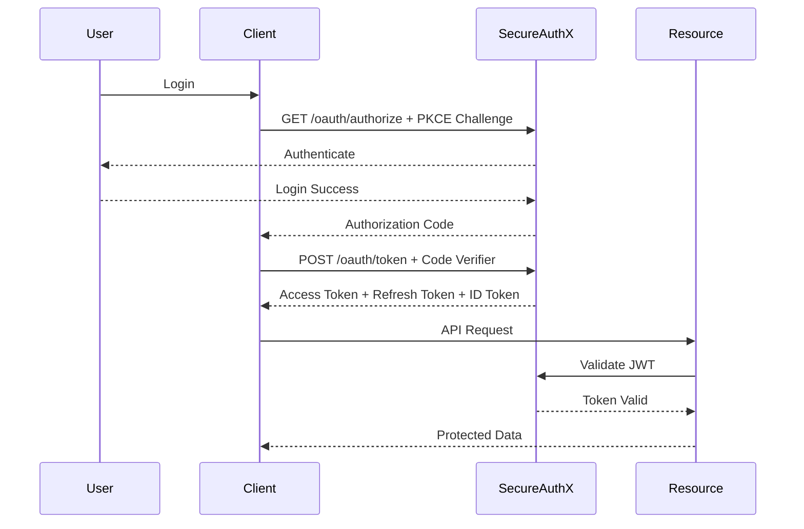

# OAuth 2.1 Authorization Code + PKCE Flow

```mermaid
sequenceDiagram

    participant User
    participant Client
    participant SecureAuthX
    participant Resource

    User->>Client: Login
    Client->>SecureAuthX: GET /oauth/authorize + PKCE Challenge
    SecureAuthX-->>User: Authenticate
    User-->>SecureAuthX: Login Success
    SecureAuthX-->>Client: Authorization Code
    Client->>SecureAuthX: POST /oauth/token + Code Verifier
    SecureAuthX-->>Client: Access Token + Refresh Token + ID Token
    Client->>Resource: API Request
    Resource->>SecureAuthX: Validate JWT
    SecureAuthX-->>Resource: Token Valid
    Resource-->>Client: Protected Data
```