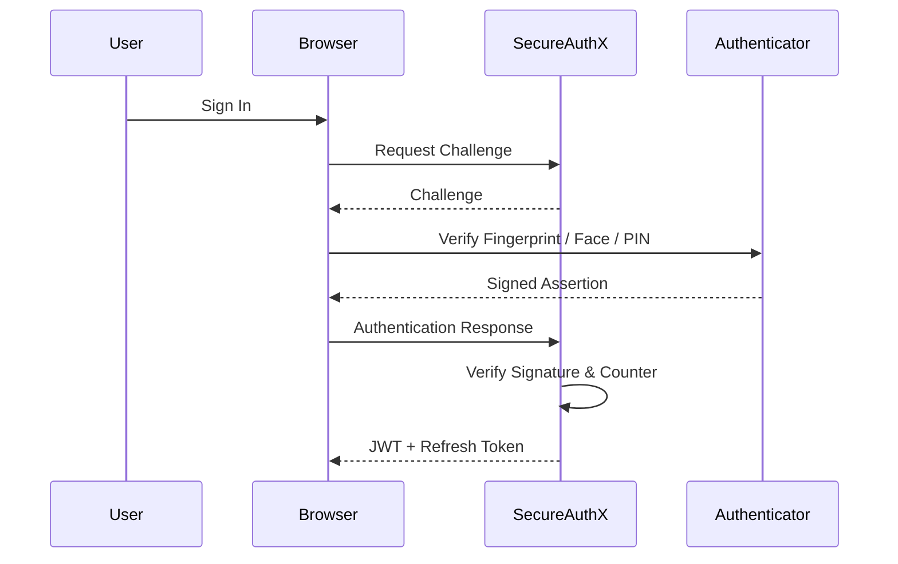

# Passkey (WebAuthn) Authentication Flow

```mermaid
sequenceDiagram

    participant User
    participant Browser
    participant SecureAuthX
    participant Authenticator

    User->>Browser: Sign In
    Browser->>SecureAuthX: Request Challenge
    SecureAuthX-->>Browser: Challenge
    Browser->>Authenticator: Verify Fingerprint / Face / PIN
    Authenticator-->>Browser: Signed Assertion
    Browser->>SecureAuthX: Authentication Response
    SecureAuthX->>SecureAuthX: Verify Signature & Counter
    SecureAuthX-->>Browser: JWT + Refresh Token
```