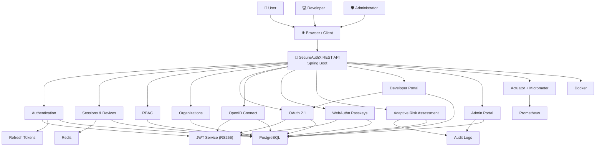

# SecureAuthX System Architecture

```mermaid
flowchart TB

    %% ===========================
    %% Client Layer
    %% ===========================

    User["👤 User"]
    Browser["🌐 Browser / Client"]
    Developer["💻 Developer"]
    Admin["🛡️ Administrator"]

    User --> Browser
    Developer --> Browser
    Admin --> Browser

    %% ===========================
    %% API Layer
    %% ===========================

    Browser --> API["🚀 SecureAuthX REST API<br/>Spring Boot"]

    %% ===========================
    %% Core Modules
    %% ===========================

    API --> Auth["Authentication"]
    API --> Session["Sessions & Devices"]
    API --> RBAC["RBAC"]
    API --> Org["Organizations"]
    API --> OAuth["OAuth 2.1"]
    API --> OIDC["OpenID Connect"]
    API --> Passkey["WebAuthn Passkeys"]
    API --> Risk["Adaptive Risk Assessment"]
    API --> DevPortal["Developer Portal"]
    API --> AdminPortal["Admin Portal"]

    %% ===========================
    %% Shared Services
    %% ===========================

    Auth --> JWT["JWT Service (RS256)"]
    Auth --> Refresh["Refresh Tokens"]

    OAuth --> JWT
    OIDC --> JWT
    Passkey --> JWT

    Session --> Redis["Redis"]

    Risk --> Audit["Audit Logs"]

    DevPortal --> OAuth

    AdminPortal --> Audit

    %% ===========================
    %% Database
    %% ===========================

    Auth --> DB
    Session --> DB
    RBAC --> DB
    Org --> DB
    OAuth --> DB
    OIDC --> DB
    Passkey --> DB
    Risk --> DB
    DevPortal --> DB
    AdminPortal --> DB

    DB["PostgreSQL"]

    %% ===========================
    %% Monitoring
    %% ===========================

    API --> Metrics["Actuator + Micrometer"]
    Metrics --> Prom["Prometheus"]

    %% ===========================
    %% Deployment
    %% ===========================

    API --> Docker["Docker"]
```